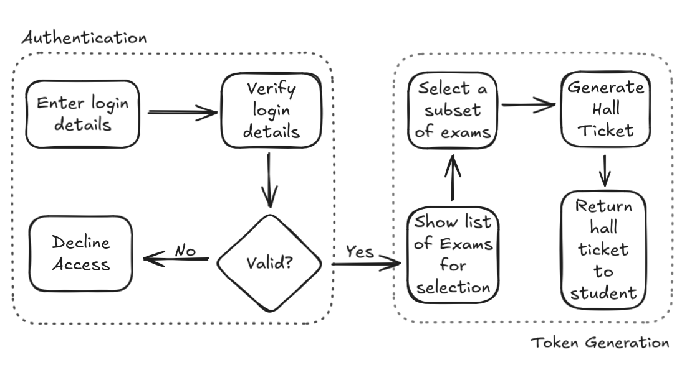
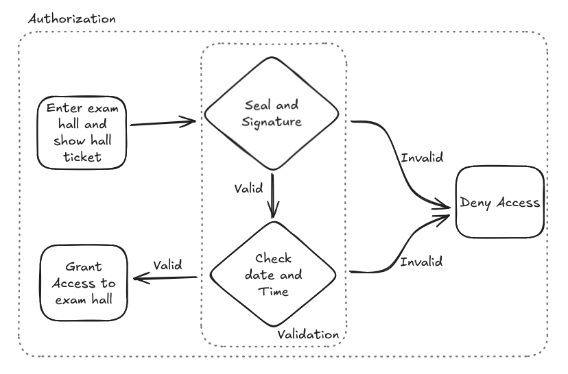
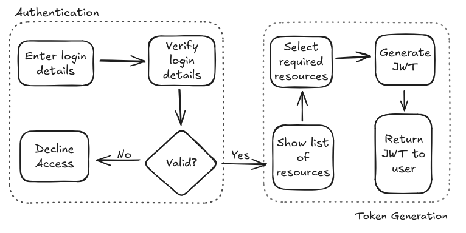
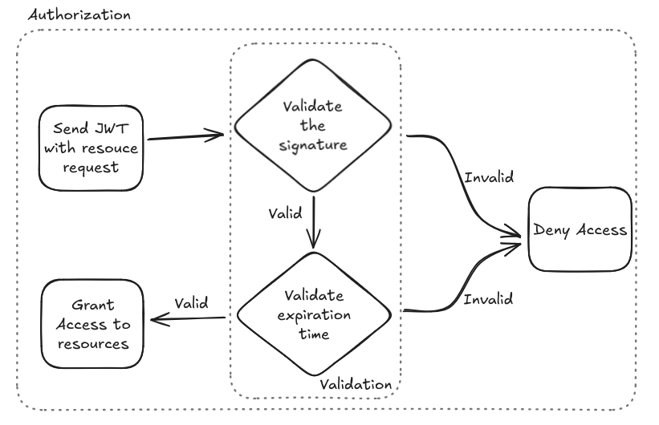

### Use of JSON Web Tokens (JWT) for Authentication and Authorization


## Agenda
- What is JWT?
- Authentication and Authorization
- Structure of JWT
- Analogy
- JWT Authentication and Authorization
- Security Considerations
- Technologies using JWT
- Implementation Examples


### What is JWT?
JSON Web Tokens (JWT) are compact, ___URL-safe___ tokens used for securely transmitting information between parties as a ___JSON object___.

~RFC 7519
Note: It's a protocol part of the application layer. URL-safe tokens ( can be directly put in the URL ) doesn't contain "/", "?" and "&". JSON ( JavaScript Object Notation ) text-based format that is easy for both humans and machines to parse


### Reserved Characters
> : / # ? & @ % +

`https://jwt.io/#debugger-io?`
token=__eyJhbGciOiJIUzI1NiIsInR5cCI6IkpXVCJ9.
eyJzdWIiOiIxMjM0NTY3ODkwIiwibmFtZSI6IkpvaG.
SflKxwRJSMeKKF2QT4fwpMeJf36POk6yJV_adQssw5c__
Note: Highlighted part is the token, usually not sent in the URL 


### JSON ( JavaScript Object Notation )
```json [1:]
 {  
     "employee": {  
         "name":       "Mario",   
         "salary":      56000,   
         "married":    true  
     }  
 }
```


### Authentication
Authentication is the process of verifying the identity of a user, device, or process.
Note: Authentication is the process of determining whether someone or something is who or what they say they are. Showing something unique that proves their identity


### Authorization
Authorizing is the process of granting a user or group the ability to access a __resource__ and perform specific actions on it
Note:Example, authorizing someone to enter your house. An object that a user can access in a system. Could be anything like files, networking, databases etc


### Structure of JWT
```json
{ //Header
  "alg": "HS256",
  "typ": "JWT"
}
{ //Payload
 "name":       "Mario",   
 "salary":      56000,   
 "married":    true  
}
HMACSHA256( // Signature
  base64UrlEncode(header) + "." +
  base64UrlEncode(payload),
  "Secret Key"
)
```


### Authentication and Authorization in University Semester Exams


### Authentication

Note: The process of authentication while applying for a university exam


### Authorization



### JWT Authentication and Authorization


### Authentication



### Authorization



### Advantages of JWT

#### Stateless
JWTs are self-contained, no server side storage required like sessions and cookies.

#### Compact and Efficient
Can be encoded as part of the URL or as a standard http header

#### Secure
It uses secure cryptographic algorithms like HMAC or RSA


### Disadvantages of JWT

#### Irrevocability
Once a JWT is issued, it cannot be revoked or invalidated.

#### No Builtin Encryption
The payload and headers are not encrypted are human readable.

#### Token Expiry Handling
Short expiration requires frequent re-authentication.


### Implementation Example 

Authentication and Token Generation
```python [120: 2-7]
if username == "testuser" and password == "password123":
    token = jwt.encode({
        'user': username,
        'exp': datetime.datetime.utcnow() +
            datetime.timedelta(hours=1)
    }, SECRET_KEY, algorithm="HS256")
    return jsonify({'token': token})
return jsonify({'message': 'Invalid credentials'}), 401
```

Authorization
```python[1: 2-3]
try:
    decoded_token = jwt.decode(token, SECRET_KEY, algorithms=["HS256"])
    return jsonify({'message': f'Welcome {decoded_token["user"]}'})
except jwt.ExpiredSignatureError:
    return jsonify({'message': 'Token has expired'}), 401
except jwt.InvalidTokenError:
        return jsonify({'message': 'Invalid token'}), 401
```


### Example using Curl
Authentication
```curl
curl -X POST http://127.0.0.1:5000/login 
-H "Content-Type: application/json" 
-d '{"username": "testuser", "password": "password123"}'
```
Response
```
{
    "token": "eyJhbGciOiJIUzI1NiIsInR5cCI6IkpXVCJ9.
    eyJ1c2VyIjoidGVzdHVzZXIiLCJleHAiOjE2Mzg1Njk5OTl9.
    Dr5qk4Bf2x_2GrhlBdOpIqxCJb21XeM9wtCh6vD-Rms"
}
```
Authorization (Access)
```curl
curl -X GET http://127.0.0.1:5000/protected
-H "Authorization: Bearer <TOKEN>"
```

